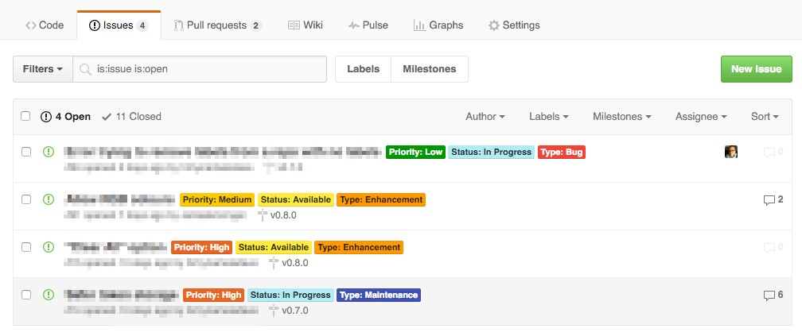
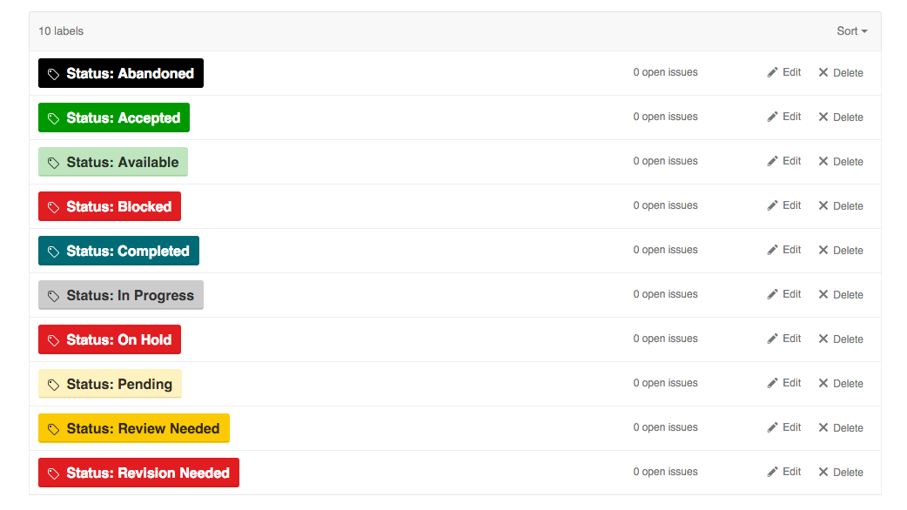
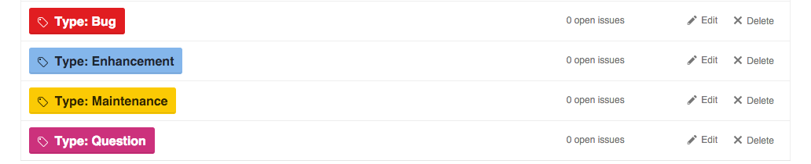
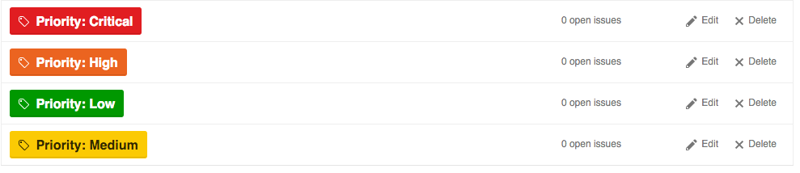

# Git Labels
Inspired by [@dave_lunny](https://medium.com/@dave_lunny/sane-github-labels-c5d2e6004b63) article, here's my list of default labels for git projects (GitLab/Hub).

## Status
* Status: Abandoned
* Status: Accepted
* Status: Available
* Status: Blocked
* Status: Completed
* Status: In Progress
* Status: On Hold
* Status: Pending
* Status: Review Needed
* Status: Revision Needed

## Type
* Type: Bug
* Type: Enhancement
* Type: Maintenance
* Type: Question
* Type: Documentation

## Priority
* Priority: Critical
* Priority: High
* Priority: Medium
* Priority: Low

